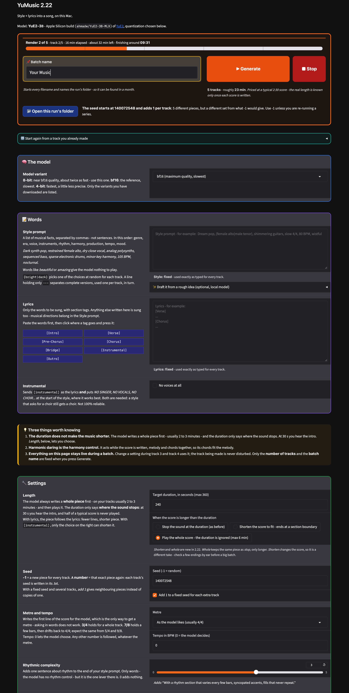

# YuMusic — lyrics and a style prompt into a song, on Apple Silicon

**A complete front-end for [YuE2](https://github.com/multimodal-art-projection/YuE) on Apple Silicon, written for people who make music rather than people who write code.**

A style description and lyrics in, a song out. Every control the model
actually accepts — style, lyrics, duration, metre, tempo, seed, and a
harmony the base model normally keeps too safe — is on one page, in plain
English, with the trade-off written **beside** each control instead of
buried in a wiki. Nothing leaves your Mac.



*One page, live while a batch runs.*

> This is an **unofficial** front-end. It is not made by or affiliated with
> the YuE / m-a-p team. It does not include the model.

**[Installation, step by step, assuming no Terminal experience →](INSTALL.md)**
· [Ce README en français →](README.fr.md)

---

## 🆕 New in 2.22

- **Length, explained and under your control.** YuE2 always writes a *whole*
  piece first — usually 2 to 3 minutes of score — and the duration only
  decides where the sound stops. Measured on 181 tracks, the median render
  played **45%** of its own score; at 30 seconds you hear the intro. After
  every track the page now says how long the score was and how much of it you
  heard, and a new choice decides what happens when the score is longer:
  stop the sound (as before), **shorten the score** so it ends at a section
  boundary, or **play the whole score**.
- **Harmonic daring says what to expect** at each setting — how many chords,
  how often the key changes, how often the score breaks, measured on 181
  tracks — instead of showing sampling numbers.
- **Style strength is now "Style-prompt fidelity", in Advanced.** It doubles
  the render time and its effect has not been measured yet.
- **A cleaner page:** every explanation rewritten and shorter, Words on two
  columns, a clearer run bar, and a player that is a player rather than a
  drop zone.

Older versions stay available — see [Versions](#-versions).

---

## 🧪 Still experimental

Three controls on this page do not fully deliver what their name promises,
and burying that in a table further down would be dishonest.

**Harmonic daring** pushes the model's own score-planning sampling past the
range it was tuned for. That is the entire mechanism - there is no separate
"safe" version of a daring score underneath it. High settings can, and
sometimes do, produce a score that falls apart rather than one that is
merely surprising. The line under the slider says what each setting gave on
181 test tracks: 7 to 9 was the useful zone there, and 10 sometimes broke the
score. Different prompts, a few tracks for some settings: a trend, not a
promise.

**Instrumental does not reliably silence the model.** Ticking it asks YuE2
for no voice at all, and it measurably reduces vocals - but the base model
does not obey the instruction the way a dedicated switch would. Some
renders still come back with singing. Treat a fully instrumental take as a
good outcome this render gave you, not a guarantee the setting makes.

**Shorten the score to fit** (new in 2.22) has not yet been judged by ear
over many tracks: whether YuE2 plays a real ending when the score stops
before its own outro is not known. Listen to the last seconds of a few
tracks before trusting it with a long batch.

---

## 🤔 Why this exists

YuE2 writes a full musical score — melody and chord symbols, in ABC notation
— before it renders a single sample of audio. That planning stage decides
the harmony, and it ships locked at a conservative setting. Nobody tells you
this either, and it is the reason the model keeps handing back plain,
diatonic triads however adventurous your style prompt reads: the harmony was
already decided, safely, before the words you wrote were ever set to sound.

So the first thing this front-end does is put that setting on the page as
**Harmonic daring** — a slider from the model's own cautious default up to
genuinely unstable — because the words "jazz harmony" or "chromatic" in a
style prompt cannot reach a decision the model makes before it reads them
as anything but style.

The rest of the app follows the same rule as everything else I build this
way: **if a setting does something, say what, in the sentence next to it.**

---

## 🎛️ What it does

**Make a song from a style prompt and lyrics.** English lyrics, section tags
(`[Verse]`, `[Chorus]` and five more) inserted at the cursor with one click,
and an **Instrumental** switch for no voice at all.

**Harmonic daring**, from the model's own safe default up to something that
will genuinely surprise you — see above.

**Restore a track completely.** Every render writes a `.txt` beside it
holding every setting used, and the score itself as a `.abc` file. Drop
**any file belonging to a track** — the `.txt`, the `.wav`, the score — and
every control on the page goes back to what made it. The seed is what
reproduces the composition: restore a track, choose **Play the whole score**,
and you get the same piece without the cut.

**Know what you heard.** After every track: *Score: 53 bars, about 2:20.
Heard: 1:00 = bars 1 to 22, 43% of the score. Never reached: chorus,
interlude, outro.* The same line is written into the track's `.txt`.

**Batches that stay editable.** Up to 100 tracks, and **everything on the
page stays live while a batch runs** — change the style, the lyrics, the
duration, the metre, the daring, even the model variant, during track 3, and
track 4 obeys. Two things freeze once you press Generate, because they
decide the shape of the run rather than of a track: the **number of
tracks** and the **batch name**.

**Dynamic and sequential prompts**, in both the style and the lyrics:

🎲 **Dynamic.** One option drawn per render, fresh every time:

```
{slow|fast} {piano|guitar} piece, {warm|cold}
```

🔁 **Sequential.** Complete versions separated by a line of three or more
dashes, used one per track, in order, looping if you run past the end:

```
first idea
---
second idea
```

**A local model can draft a style prompt** from a rough idea — *a sad the
cure track, slow, with choir at the end* — through
[Ollama](https://ollama.com) running entirely on your own Mac. Its real job
is not polish but **translating a reference into musical facts**, which is
the one thing a preset library can never do: YuE2 does not know who The
Cure are, but it knows what *post-punk, melancholic male baritone, echoing
guitar, reverb-drenched production* means. Optional; the rest of the app
works without it.

**Sheet music of every track**, the ABC score YuE2 planned before it
rendered a single sample, viewable right on the page.

**A per-run folder**, named by you, holding the audio, the score, the
settings `.txt`, and optionally MP3, FLAC and MIDI copies alongside the
WAV.

**Two buttons for "where did it go?"** — the folder this run is writing
into, from the run bar, and the track you are listening to, selected in the
Finder.

---

## ⚠️ Three things worth knowing before your first render

**1. The duration does not make the music shorter.** The model writes a
whole piece first and the duration only says where the sound stops. With
lyrics, the length follows the lyrics (fewer lines, shorter piece). With an
instrumental, only *Shorten the score to fit* can make the piece itself
shorter.

**2. The model's own duration ceiling is six minutes.** Ask for more than
360 seconds and it simply stops at six.

**3. Instrumental means the lyrics are thrown away, not sent as a
suppression.** Tick it and whatever is in the Lyrics box is ignored in
favour of an explicit instrumental marker — you do not need to clear the
box first, and leaving text in it costs nothing.

---

## 🍏 Requirements

| | |
|---|---|
| **Mac** | Apple Silicon — M1 or later. Intel Macs cannot run this. |
| **Memory** | Not measured below 64 GB here; the model weights are small (4.2 GB for 8-bit), so 16 GB should be workable. |
| **Disk** | ~5 GB for the recommended 8-bit model; up to ~11 GB more if you add bf16 and 4-bit as well. |
| **macOS** | Sonoma (14) or later. |
| **Also needed** | The YuE2-3B-MLX model — [INSTALL.md](INSTALL.md) covers it. |
| **Optional** | [Ollama](https://ollama.com) (style-prompt drafting). **For MP3/FLAC/MIDI export and the sheet-music preview:** `ffmpeg`, `abcmidi` and `abcm2ps`, all via Homebrew — [INSTALL.md](INSTALL.md) covers it. Without them, ticking those boxes writes a line to the Log explaining what's missing, not a silent success. |

---

## ⏱️ Measured by the model's own authors, on an M-series Mac

I have not run controlled timing here yet — these numbers are from the
[YuE2-3B-MLX](https://huggingface.co/ahmadw/YuE2-3B-MLX) model card itself,
quoted rather than guessed at:

| Variant | Decode speed | Size |
|---|---|---|
| 8-bit (recommended) | ~80 tokens/s with CFG | 4.2 GB |
| bf16 (reference quality) | ~70 tokens/s (~35 with CFG) | 7.0 GB |
| 4-bit (fastest, some drift) | fastest, some quality loss | 3.4 GB |

A three-minute song takes a few minutes end to end on Apple Silicon.

---

## 🎚️ The controls, in order

### The model

**Model variant.** 8-bit is the one to use — near bf16 quality, about twice
as fast to decode. bf16 is the reference and the slowest. 4-bit is fastest
and drifts furthest from the reference. **Only the variants you have
actually downloaded are listed** — the menu adapts to what is on disk.

### Words

**Style prompt.** A list of concrete musical facts separated by commas, not
sentences and not a pile of adjectives — roughly: genre, era or aesthetic,
vocal character, instruments, rhythmic character, harmonic language,
production, approximate tempo, mood. *"Beautiful, emotional, amazing" tells
the model nothing it can play; "restrained female alto, dry close vocal"
tells it exactly what to do.*

**Lyrics**, with section tags inserted at the cursor by seven buttons beside
the box, so you can paste lyrics first and tag them afterwards.

**Instrumental** — see the warning above.

### Settings

**Length** — the target duration in seconds (360 at most), and what to do
when the score is longer: *stop the sound at the duration* (as before),
*shorten the score to fit* (it ends at the nearest section boundary; a
different take), or *play the whole score* (the same take as *stop*, only
longer; the duration is ignored).

**Seed** — `-1` for a fresh random seed per track, or a fixed number to
reproduce a piece — every track writes its own seed into its `.txt`. With a
fixed seed, *add 1 for each extra track* gives neighbouring pieces instead of
copies.

**Metre and tempo** — a metre menu and a tempo number, `0` for "model
decides".

**Rhythmic complexity**, a slider from straightforward to intricate. The page
shows the exact sentence it adds to your style prompt.

**Harmonic daring** — see *Why this exists* above. The line under the slider
says what each setting gave on 181 test tracks.

### Advanced

**Style-prompt fidelity (CFG)** — how hard the sound is pushed toward the exact
wording of the style and lyrics. 1.0 is off; above that a render takes about
twice as long. Not measured yet: compare a few tracks before using it on a
batch. **Score planning** — *melody + chords* is what harmonic daring acts on;
turning it off skips straight to audio and there is then no score to
inspect. **Start from an existing score** hands the app an `.abc` file to
render as-is, which is how a score you edited by hand gets back into the
model. **Audio refinement steps** — 32 is the model's own setting; leave it
there unless you are experimenting.

### The run

**Number of tracks**, up to 100, each with its own seed, all landing in one
folder named after the **batch name**. **Extra formats** — MP3, FLAC and
MIDI copies alongside the WAV and the `.abc` score, which are always
written.

### Results

The audio player, how long the score was and how much of it you heard, a
button to reveal the playing track in the Finder, the resolved prompt for the track in progress, the list of files this run has
saved, a running log, and the sheet music of the latest track.

---

## 🔧 Design notes

A few decisions that are deliberate, in case they look like oversights:

- **It calls the model repo's own pipeline rather than reimplementing
  it.** The one thing it adds is exposing the score-planning stage's
  sampling settings — temperature, top-p, top-k — which the model repo's own
  command line does not expose. That is what "Harmonic daring" actually
  turns.
- **Repetition penalty is deliberately not exposed.** ABC notation has to
  repeat bar lines, rests and note letters constantly; penalising repetition
  there would corrupt the notation rather than loosen the harmony.
- **Length is measured, not guessed.** `score_length.py` reads the score as
  bars and seconds, and the renderer cuts it at a section boundary *before*
  the audio is made, inside the model's own process — no second model load.
- **Nothing is uploaded, ever.** No telemetry, no account, no network call
  except the one that downloads the model weights, once.

---

## 📦 Versions

This page describes **2.22**, the current version. Earlier versions stay
available: each one is a
[tag](https://github.com/Quick-Eyed-Sky/yumusic-mac-mlx/tags) with its own ZIP
download, and with git, `git checkout v2.20` brings back the first public
version.

| Version | |
|---|---|
| **2.22** (current) | Length explained and controllable, daring says what to expect, Style-prompt fidelity moved to Advanced, the page rewritten. |
| 2.20 | First public version. |

**Updating:** with git, `git pull` in the folder. With a ZIP, your renders
live in the app's own `outputs` folder — move that folder out before you
replace the old folder with the new one.

---

## 📜 Licences and attribution

**This front-end** is MIT — see [LICENSE](LICENSE). Do what you like with
it.

**The model is not included here, and its licence is not MIT.** The
YuE2-3B-MLX weights this app drives are downloaded separately by you, and
they are licensed **CC BY-NC 4.0 — non-commercial** by their original
authors, inherited from [m-a-p/YuE2-3B](https://huggingface.co/m-a-p/YuE2-3B)
and [m-a-p/YuE2-Vae](https://huggingface.co/m-a-p/YuE2-Vae). That is a real
restriction, not a formality: check
[the model card](https://huggingface.co/ahmadw/YuE2-3B-MLX) and the
[original YuE2 project](https://github.com/multimodal-art-projection/YuE)
before using anything you make with this commercially, rather than taking my
word for it — licences change, and this one is already stricter than most.

Nothing in this repository is generated audio, and no audio you make with it
passes through me or anyone else.

---

## 👋 Who made this

Jean-Pascal — **[Quick-Eyed Sky](https://www.youtube.com/@QuickEyedSky)** on
YouTube, [QES](https://huggingface.co/QES) on Hugging Face. Not a
programmer: this exists because the harmony was too safe and I wanted to
open the one setting that actually controls it.

If it saved you an afternoon, you can
[buy me a coffee](https://buymeacoffee.com/oFJ5CiY7n). Entirely optional,
and the project stays exactly as free either way.

<a href="https://buymeacoffee.com/oFJ5CiY7n"></a>

---

## 🙏 Thanks

To the [YuE2 / m-a-p team](https://github.com/multimodal-art-projection/YuE)
for the model, and to
[ahmadw](https://huggingface.co/ahmadw/YuE2-3B-MLX) for the native MLX port
that makes it run this way on a Mac at all.
